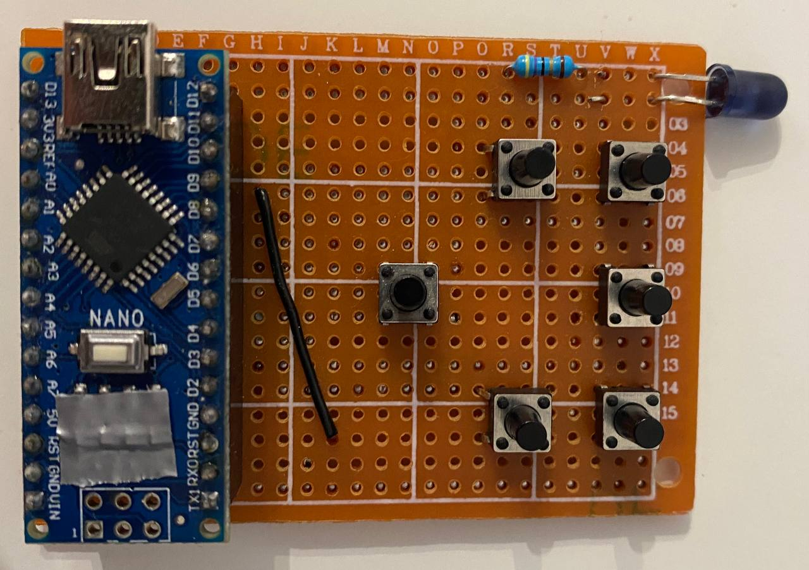
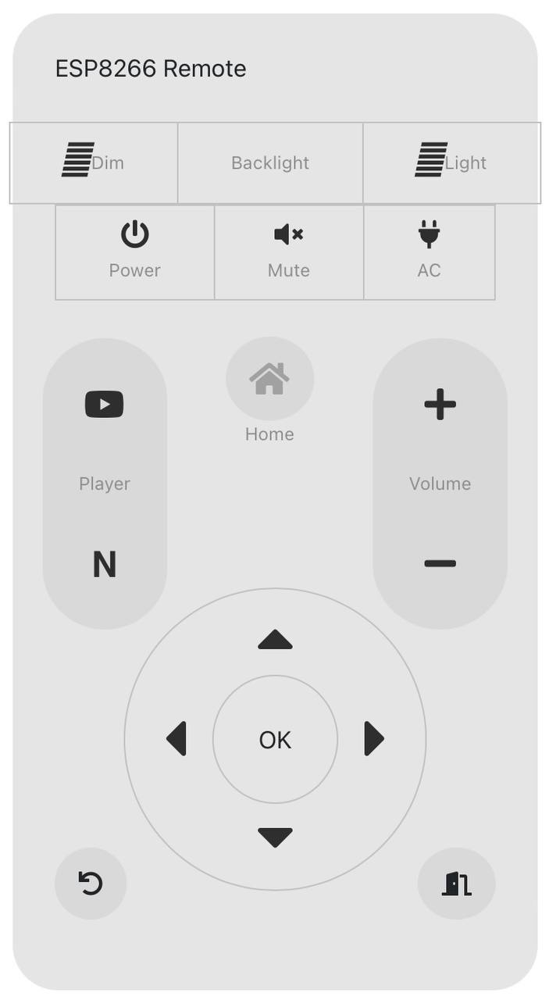

# Pilot-mieszkanie
W mieszkaniu do którego się wprowadziłem na czas studiów znajdował się telewizor bez pilota.\
Na początku planowałem po prostu z niego nie kożystać, ale zainspirowany [tym filmem](https://youtu.be/j1V2I-otdzk) postanowiłem wziąć sprawy w swoje ręce.\

## Moim pierwszym rozwiązaniem był primtywny pilot na płytce stykowej

Pilot był zasilany bezpośrednio z 9V baterii, kod do pilota znajduje się [tutaj](Pierwsze-podejscie/remote/remote.ino)\
Największym wyzwaniem w tym podejściu było znalezienie odpowiednich sygnałów IR do sterowania pilota.\
Rozwiązaniem było pożyczenie działającego pilota od mojego współlokatora i zczytanie sygnałów z interesujących mnie przycisków za pomocą odbiornika IR.
## Podejście drugie
Pilocik na płytce był fajny ale miał sporo problemów, między innymi:\
* Krótką żywotność baterii
* Był wyjątkowo nie poręczny
* Dioda IR była bardzo kierunkowa co utrudniało celowanie\

Każdy z tych problemów można było adresować pojedyńczo, zdecydowałem się jednak na inne rozwiązanie.\
Postanowiłem przenieść diodę IR bezpośrednio pod telewizor i komunikować się z nią po lokalnym WiFi
Ostateczne rozwiązanie składa się z dwóch części:
* Arduino które operuje diodą i symuluje pilot do telewizora
* ESP które hostuje stronę i rozkazuje arduino co ma robić

## Dodatkowe Udogodnienia
Mając w pokoju permanentie działający serwer ESP skorzystałem z tego żeby rozwiązać parę innych powiązanych problemów:
* Zasilacz w telewizorze wydaje cichy pisk, w ciągu dnia nie jest to problem ale w nocy doprawadzało mnie to do szału.
> Rozwiązaniem było dołączenie przekaźnika szeregowo z telewizorem w taki sposób, że teraz mogę z poziomu telefonu odłączyć i podłączyć telewizor do prądu. Ogranicza to również zużycie prądu telewizora.
* Chciałem dodać backlight do telewizora
> Rozwiązanie było wyjątkowo proste, zasilacz już miałem jako, że był potrzebny do mikrokontrolerów wystarczyło dodać jeden tranzystor do sterowania zasilaniem i parę ekstra linijek kodu żeby móc sterować nim z telefonu.
